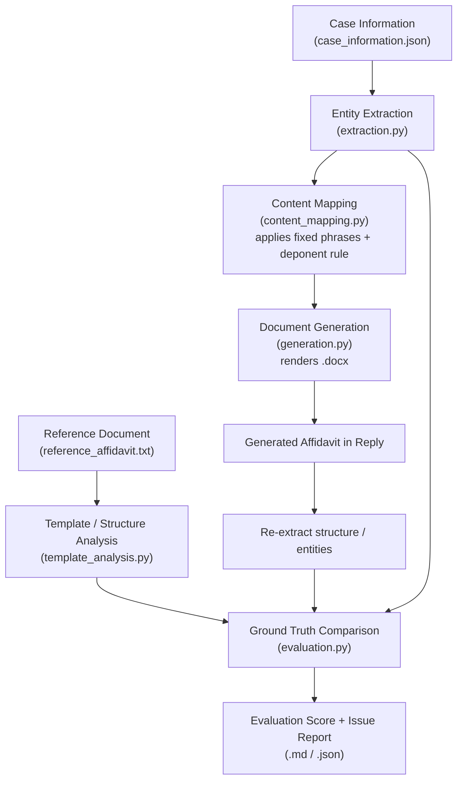

# Legal Document Generation & Evaluation Agent

A modular AI agent that reads a reference **Affidavit in Reply**, extracts structured
entities from a separate case-information file, generates a new Affidavit in Reply
that preserves the reference format, and then evaluates its own output against the
supplied ground truth  producing a scored report with a specific, traceable list of
issues. Built for the Brainwonders AI Internship take-home assignment.


## What it does

The app opens on a landing screen (title + one-line pitch over a themed
background) with an **Enter the Agent** button, then moves into the actual
workflow:

1. **Template / structure analysis** — parses the reference affidavit into its 10 fixed parts.
2. **Entity extraction** — loads `data/case_information.json` into a structured schema (forum, parties, deponent, reply points, exhibits, attestation).
3. **Content mapping** — maps each reply point onto the correct paragraph "move" (identity/perusal, blanket denial, preliminary position, substantive answer, closing), applying the fixed-phrase glossary and the **deponent rule** (a person deposes for themself; an officer deposes *"as the [designation] of"* an organisation respondent).
4. **Document generation** — renders a formatted `.docx` following the reference structure (headings, numbering, bold conventions).
5. **Evaluation** — re-derives the generated document's structure and entities, compares them against the ground truth, and scores six dimensions: entity accuracy, completeness, structure, consistency, template fidelity, hallucination.
6. **Report** — a Markdown + JSON report with an overall score, per-dimension scores, and a specific, source-cited issue for every deduction.

## Setup

**Python:** 3.11+ (developed and tested on 3.12)

```bash
git clone <YOUR_REPO_URL>
cd legal-doc-agent
python -m venv venv && source venv/bin/activate   # optional but recommended
pip install -r requirements.txt
cp .env.example .env     # optional — only needed for the LLM-polish bonus feature
```

No API key is required to run the core pipeline. `ANTHROPIC_API_KEY` in `.env` is
**optional** and only enables the Stage 4b LLM-polish bonus feature (see Design
Decisions below).

## How to run it

**Generate the affidavit + evaluation report from the command line:**
```bash
python -m src.pipeline
```
This reads `data/case_information.json` and `data/reference_affidavit.txt`, and
writes `outputs/generated_affidavit.docx`, `outputs/evaluation_report.md`, and
`outputs/evaluation_report.json`.

**Run the interactive demo app:**
```bash
streamlit run app.py
```
Then open the local URL Streamlit prints (usually `http://localhost:8501`). The app
lets you use the bundled sample case/reference, or upload your own, and shows the
generated document, the evaluation report, and the intermediate extracted data in
separate tabs.

**Run the test suite:**
```bash
pytest tests/ -v
```
11 tests: 3+ deterministic-check tests (assignment minimum bar), 3 happy-path
structural tests, and 5 **fault-injection** tests that deliberately corrupt a
correct output and assert the evaluator actually catches each specific corruption
(wrong respondent number, mismatched paragraph range, missing section, hallucinated
date, missing deponent designation). A report that always says "100/100" regardless
of input is not a real evaluator — these tests exist to prove this one isn't that.

## Architecture



## Design decisions

**Deterministic template-filling instead of free LLM generation, for the skeleton.**
The format spec (`01_Affidavit_Format_Explained.pdf`) gives an exact, fixed
structure with rules explicitly marked "must never break" (paragraph-count/verb
agreement). For a fixed, well-specified document type, letting an LLM freely
generate this text would only add hallucination risk for zero benefit  a rule-based
renderer guarantees 100% template fidelity and zero hallucinated structure by
construction. **Rejected:** pure LLM generation from a prompt containing the
reference + case info; too easy for a model to silently invent or drop a required
part under this scoring rubric.

**All evaluation checks are deterministic (regex/rule-based), not LLM-graded  and
there are more than the required minimum of three.** Nine checks run across the six
dimensions. Every issue cites the specific rule/section it violates (see the
`source` field), so scores are fully reproducible and auditable, unlike an LLM
grader's subjective judgment call. **Rejected:** using an LLM to "grade" the
generated document; it would be non-reproducible and unable to point to an exact
rule the way a regex check can.

**The deponent rule is applied structurally, not by copying the sample.** The
reference sample happens to have a *person* respondent deposing for themself; the
actual case (MMRDA, an authority) requires an *officer* deposing "as the Deputy
Metropolitan Commissioner of the Respondent No.2." A naive approach that pattern-
matches the sample's wording would get this specific case wrong. `extraction.py`
computes `deponent_is_organisation_officer` from the data itself, and
`content_mapping.py` branches on it — this is exercised directly by
`test_deponent_rule_applied_for_organisation_respondent` and its matching
fault-injection test.

**Fixed legal phrases are only used where the supplied facts actually support
them.** The reference sample includes the boilerplate phrase *"the Petitioner has
suppressed material facts"* in its Preliminary Position paragraph  but the supplied
case information for this case makes no such claim. Copying that phrase over would
be inventing an unsupported factual assertion (exactly what the Hallucination
dimension is meant to catch), so it's deliberately omitted here. This is the same
reasoning applied to substantive-answer paragraphs: an earlier draft prepended "the
same are false, incorrect and denied" before *every* substantive point, which is
factually wrong for an affirmative point like "Authority for the Communication" (an
explanation, not a denial)  this was identified and corrected during development,
before this was reviewed as a finished module, to a neutral lead-in that lets each
point's own content carry its actual meaning.

**LLM polishing is optional, constrained, and has a verified fallback.** `src/llm_polish.py`
can lightly smooth paragraph phrasing via Claude if `ANTHROPIC_API_KEY` is set, but
is explicitly instructed never to add/remove/alter any fact, name, date, or number,
and a post-hoc check reverts to the deterministic text if the polished version
introduces any date not in the original. This mirrors the honest-fallback pattern
I used in an earlier personal project (a RAG pipeline that degrades gracefully to
extractive mode if the local LLM is unavailable, rather than failing outright).

**Structured JSON intermediate representation between every stage.** `Entities` →
`MappedContent` are typed dataclasses, not strings-with-string-parsing, so each
stage has a clear contract and can be unit tested independently (see `tests/`).

**Landing screen background is embedded as base64, not a linked file.** `app.py`
reads `assets/hero_background.jpg` and embeds it directly into the injected CSS
via a data URI. This means the background can never show as a broken image on a
fresh deployment regardless of static-file-serving quirks on a given host —
there's no separate asset URL that can 404.

## Known limitations and failure cases

- **Single document type, single case, by design** — this only handles Affidavit in
  Reply, and the entity extractor expects the specific JSON shape used here. Scope
  was deliberately kept small per the assignment's Section 5.
- **Prose can read as slightly repetitive**  because generation is template-filling
  rather than free rewriting, some substantive paragraphs share similar sentence
  openers ("With reference to the averments made in the Petition, I say that..."). The
  optional LLM-polish stage can reduce this, but is off by default.
- **Reference-document parsing (`template_analysis.py`) is regex-based** and expects
  the reference document's section labels/spacing to roughly match the sample
  provided. A materially different reference document layout could cause a part to
  be mis-detected — this would show up as a lower "Template Fidelity" score, which
  is itself a useful signal, but wouldn't crash the pipeline.
- **Hallucination check only scans for extraneous dates** in the current
  implementation, not all entity types (names, amounts, statutory citations) — a
  reasonable minimum-viable version of this check, not an exhaustive one.
- **No handling of a second document type** was attempted (listed as "nice to have,"
  not required).

## Correction log

**Evaluation was checking its own blueprint, not the delivered file (fixed).**
Originally, `evaluate()` was given `generated_text` from
`full_text_from_mapped_content(mapped)` — a text reconstruction of
`MappedContent`, the same object that was fed INTO `generate_docx()`. That
meant none of the six evaluation dimensions ever actually read the
generated `.docx`; a bug in `generation.py`'s docx-writing code (a dropped
paragraph, a garbled heading, a mis-numbered section) could not have been
detected, no matter how good the checks looked on paper. Per the
assignment's own Section 9 workflow ("Generated Affidavit in Reply →
Entity/Structure Extraction → Ground Truth Comparison"), the evaluation is
supposed to extract from the generated artefact, not its precursor.

Fixed by adding `src/doc_reading.py` (reads the actual `.docx` bytes) and
`ground_truth_comparison()` in `evaluation.py` (cross-checks that real text
against `case_information` and the mapping stage's own expectations —
paragraph count, sequencing, respondent numbers, verification range,
exhibit labels, required headings). `pipeline.py` now passes the real
extracted text into `evaluate()` instead of the reconstruction.
`tests/test_ground_truth_extraction.py` proves this mattered: it simulates
a realistic generation bug (`generate_docx()` silently dropping the last
body paragraph while writing), and shows the OLD evaluation path still
returns zero Structure issues on the buggy file, while the NEW path catches
it immediately. On the actual (bug-free) `generate_docx()`, the fix changes
nothing — still 100/100 — which is the correct outcome: the fix adds a
check that was structurally incapable of firing before, it doesn't loosen
or tighten anything that was already working.

**Three more issues from a second review — also fixed:**

1. **`app.py` was never actually fixed.** The correction above landed in
   `src/pipeline.py` (used by the CLI), but `app.py` — the Streamlit UI, i.e.
   what a reviewer actually clicks through — had its own independent
   pipeline logic and was still calling `full_text_from_mapped_content()`
   directly. The 100/100 shown in the running app was passing through the
   exact blind spot the first fix was supposed to close. Now fixed: `app.py`
   imports `extract_text_from_docx` and evaluates the real generated file,
   same as the CLI.
2. **Hallucination detection only scanned for extraneous dates.**
   `check_hallucinated_entities()` in `evaluation.py` now also cross-checks
   the generated text against every supplied name (petitioner, each
   respondent, deponent, organisation, advocate firm), designation, case
   number, and year. Verified against the exact scenario raised as an
   example — "Sunrise Housing Private Limited" silently becoming "Sunrise
   Housing Developers Private Limited" — caught cleanly, with zero false
   positives on the real clean output (`tests/test_extended_checks.py`).
3. **Template Fidelity only checked presence flags against `mapped`,
   never a real reference-vs-output comparison.** `ground_truth_comparison()`
   now parses the GENERATED text with the exact same parser
   (`template_analysis.analyze_reference_document`) used on the reference
   document, and compares the two structures directly — both sides parsed
   identically, not two independently-written rule sets that happen to
   agree. Verified by corrupting a structural marker (the PRAYER heading)
   directly in generated text and confirming it's caught.

One suggestion was deliberately NOT implemented as described: tagging
every paragraph/prayer line with an explicit case-information-vs-boilerplate
`source` field. The underlying concern — don't let legitimate template
language (prayer clauses (b) and (c), which are fixed phrases, not case
facts) get flagged as hallucinated — is already satisfied without it:
`check_hallucinated_entities()` only scans for specific supplied entity
values (names, numbers, dates), never a blanket "any unexpected phrase"
scan, so generic boilerplate text was never at risk of a false positive.
`content_mapping.py`'s existing `source_point: None` on the CLOSING
paragraph already marks the one fully-boilerplate body paragraph; adding a
parallel tagging scheme to `prayer_lines` for a risk that doesn't
materialize would be complexity without a corresponding bug fixed.

## AI assistant disclosure

Built with Claude (Anthropic) as an AI coding assistant — used for architecture
discussion, writing and reviewing the extraction/mapping/generation/evaluation
modules, the fault-injection test suite, and this README. All design decisions and
the specific fixes described above (deponent rule handling, removing unsupported
fixed phrases, correcting the substantive-answer denial logic) were reviewed and
verified by re-running the full test suite and manually inspecting the generated
document after each change. The ground-truth re-extraction fix in the *Correction
log* above was found and implemented by Claude during a review of this repository
after initial delivery, and is verified the same way — full test suite re-run
(14/14 passing) plus a new test that reproduces the exact blind spot it closes.
